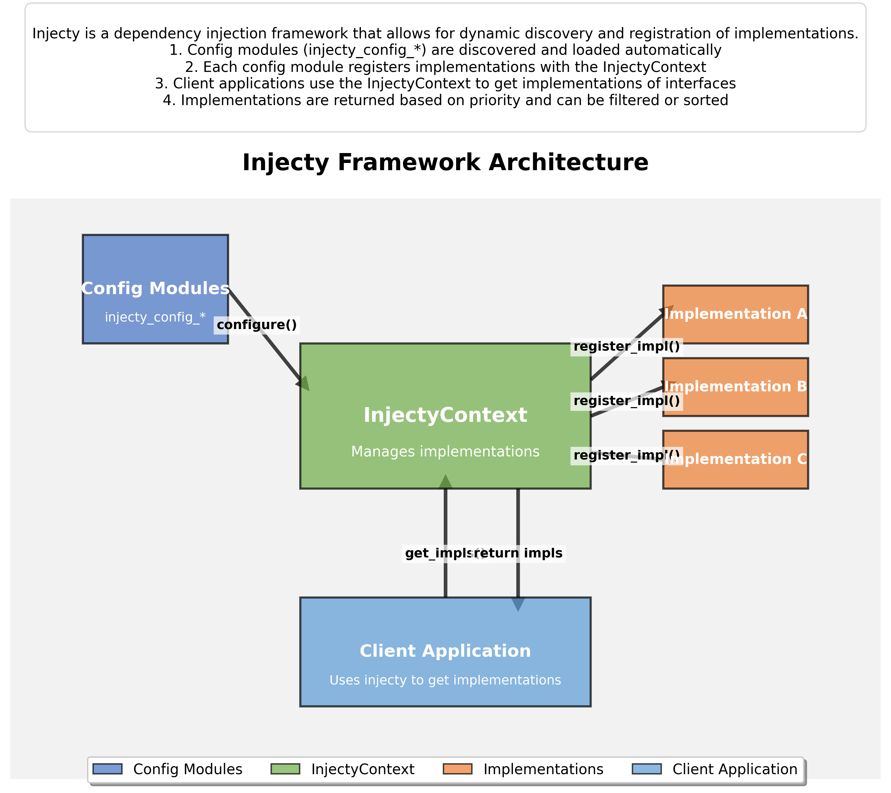

# Injecty Framework Architecture

Injecty is a lightweight dependency injection framework for Python that enables dynamic discovery and registration of implementations. This document explains the architecture and workflow of the framework.

## Architecture Overview



The diagram above illustrates the main components and interactions in the Injecty framework:

### Key Components

1. **Config Modules**: Python modules with names matching the pattern `injecty_config_*`. Each config module must have:
   - A `priority` attribute (integer) that determines the order of processing
   - A `configure(context)` method that registers implementations with the context

2. **InjectyContext**: The central component that manages implementations:
   - Discovers and loads config modules
   - Provides methods to register and deregister implementations
   - Returns implementations based on queries from client applications
   - Validates config modules to ensure they meet requirements

3. **Implementations**: Classes that implement specific interfaces or base classes:
   - Registered with the InjectyContext by config modules
   - Can be prioritized, filtered, and sorted
   - Can be instantiated automatically by the framework

4. **Client Application**: Code that uses the Injecty framework:
   - Gets implementations of interfaces using the InjectyContext
   - Can get all implementations or just the default (highest priority) one
   - Can create instances of implementations automatically

## Workflow

1. **Discovery**: When an InjectyContext is created, it automatically discovers all config modules matching the pattern `injecty_config_*`.

2. **Validation**: Each config module is validated to ensure it has:
   - A `priority` attribute that is an integer
   - A `configure` method that accepts at least one parameter (the context)

3. **Configuration**: Config modules are sorted by priority and their `configure` methods are called with the InjectyContext as an argument.

4. **Registration**: During configuration, each module registers implementations with the context using methods like `register_impl(base_class, implementation_class)`.

5. **Usage**: Client applications can then:
   - Get all implementations of a base class with `get_impls(base_class)`
   - Get the default implementation with `get_default_impl(base_class)`
   - Create instances with `get_instances(base_class)` or `get_new_default_instance(base_class)`

## Example Flow

1. A config module registers an implementation:
   ```python
   # In injecty_config_shapes.py
   priority = 0
   
   def configure(context):
       from shapes import Shape, Circle, Square
       context.register_impl(Shape, Circle)
       context.register_impl(Shape, Square)
   ```

2. A client application gets implementations:
   ```python
   from injecty import get_impls, get_new_default_instance
   from shapes import Shape
   
   # Get all implementations
   all_shapes = get_impls(Shape)  # Returns [Circle, Square]
   
   # Create an instance of the default implementation
   default_shape = get_new_default_instance(Shape)  # Returns Circle()
   ```

## Benefits of This Architecture

1. **Loose Coupling**: Implementations are decoupled from their usage, making the code more modular.
2. **Dynamic Discovery**: New implementations can be added without modifying existing code.
3. **Prioritization**: Implementations can be prioritized, allowing for default behaviors with optional overrides.
4. **Validation**: Config modules are validated to ensure they meet requirements, providing clear error messages.
5. **Flexibility**: Implementations can be filtered, sorted, and instantiated based on runtime conditions.

This architecture makes Injecty a powerful tool for building extensible and maintainable Python applications.